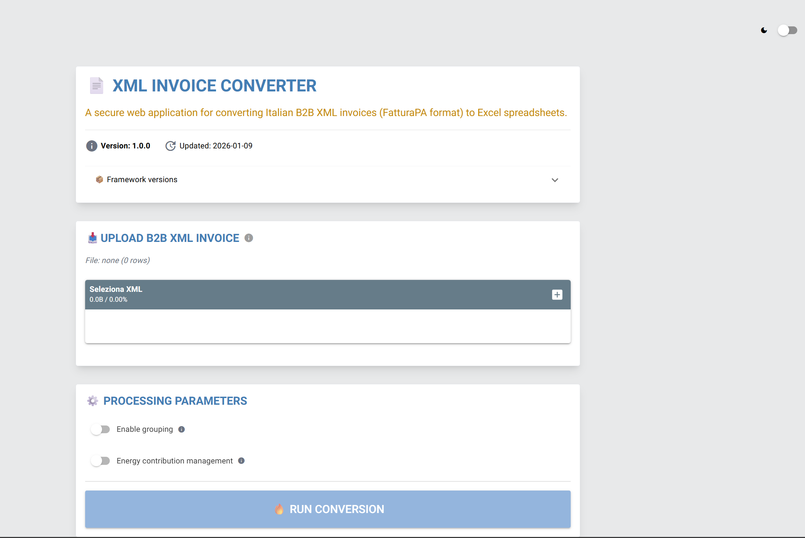

# XML Invoice Converter (XIC)

A secure web application for converting Italian B2B XML invoices (FatturaPA format) to Excel spreadsheets.



## Features

- **Secure XML Processing** - Built-in protection against XML bombs and malicious files
- **Smart Parsing** - Extracts invoice headers, line items, and attachments
- **Energy Management** - Propagates drawing numbers, orders, and DDT across lines
- **Data Grouping** - Optional aggregation by key fields
- **Excel Export** - Formatted output with professional styling
- **Dark Mode** - User-friendly interface with theme switching

## Quick Start

### Prerequisites

- Python 3.11 or higher
- pip package manager

### Installation

1. Clone the repository:
```bash
git clone https://github.com/In-dig0/vps-oci/tree/main/docker/xml_invoice_converter_app.git
cd xml-invoice-converter
```

2. Install dependencies:
```bash
pip install -r requirements.txt
```

3. Create environment file:
```bash
cp .env.example .env
```

### Running the Application

**Development mode:**
```bash
python xml_invoice_converter.py --reload --show
```

**Production mode:**
```bash
python xml_invoice_converter.py --host 0.0.0.0 --port 8502
```

The application will be available at `http://localhost:8502`

## Configuration

Edit `.env` file to customize settings:

```env
# Application
APP_NAME=XML_CONVERTER
APP_CODE=XIC
APP_VERSION=0.0.1

# Security Limits
MAX_FILE_SIZE_MB=1
MAX_LINES_PER_INVOICE=10000
MAX_XML_DEPTH=50
PROCESSING_TIMEOUT=30

# Logging
LOG_LEVEL=INFO
```

## Usage

1. **Upload XML File** - Select a valid FatturaPA XML invoice
2. **Configure Options**:
   - Enable Grouping: Aggregate lines by key fields
   - Energy Management: Propagate reference data across lines
3. **Process** - Click "RUN CONVERSION"
4. **Download** - Export results to Excel

### Output Structure

The Excel file contains the following columns:

| Column | Description |
|--------|-------------|
| `T_filein` | Source filename |
| `T_piva_mitt` | Supplier VAT number |
| `T_ragsoc_mitt` | Supplier name |
| `T_num_doc` | Document number |
| `T_data_doc` | Document date |
| `T_importo_doc` | Total amount |
| `P_nr_linea` | Line number |
| `P_codart` | Article code |
| `P_desc_linea` | Line description |
| `P_qta` | Quantity |
| `P_um` | Unit of measure |
| `P_przunit` | Unit price |
| `P_prezzo_tot` | Total price |
| `P_codiva` | VAT code |
| `P_nrdisegno` | Drawing number |
| `P_commessa` | Order number |
| `P_nrddt` | DDT number |
| `P_intento` | Intent |

## Security Features

- **File Size Limits** - Configurable maximum upload size
- **XML Depth Check** - Prevents deeply nested XML attacks
- **Safe Parsing** - Uses `defusedxml` library
- **Path Traversal Protection** - Validates filenames
- **Processing Timeout** - Prevents DoS attacks
- **SHA256 Hashing** - File integrity tracking

## Docker Deployment

Build the image:
```bash
docker build -t xic:latest .
```

Run the container:
```bash
docker run -d \
  -p 8502:8502 \
  -v $(pwd)/logs:/app/logs \
  --name xic \
  xic:latest
```

## Project Structure

## Project Structure
```
xml_invoice_converter_app/
├── src/
│   └── xml_invoice_converter.py    # Main application file
├── assets/
│   ├── icons/                       # Framework and brand logos
│   │   ├── nicegui_logo.png
│   │   ├── python_logo.svg
│   │   ├── pandas_logo.svg
│   │   └── github_logo.svg
│   └── screenshots/                 # Application screenshots
│       └── screenshot_main.png
├── logs/                            # Application and usage logs
│   └── xic_usage.log
├── .env                             # Environment configuration
├── .gitignore                       # Git ignore rules
├── docker-compose.yml               # Docker Compose configuration
├── Dockerfile                       # Docker image definition
├── README.md                        # This file
├── requirements.txt                 # Python dependencies
└── run.py                           # Application entry point
```

## Logging

Application logs are stored in `logs/xic_usage.log`:

```
2026-01-06 14:30:45 | XML_CONVERTER | XIC | PROCESS | invoice.xml | COMPLETED | Processed in 0.15s | abc123...
```

## Troubleshooting

**File upload fails:**
- Check file size (max 1MB by default)
- Verify XML format (must be FatturaPA)
- Check logs for detailed errors

**No data extracted:**
- Ensure `<DettaglioLinee>` tags are present
- Verify XML structure matches FatturaPA schema

**Performance issues:**
- Reduce `MAX_LINES_PER_INVOICE` in `.env`
- Check system resources
- Review processing timeout settings

## Dependencies

- **NiceGUI** - Web framework
- **Pandas** - Data processing
- **xmltodict** - XML parsing
- **defusedxml** - Secure XML parsing
- **xlsxwriter** - Excel generation

See `requirements.txt` for complete list.

## Contributing

Contributions are welcome! Please:

1. Fork the repository
2. Create a feature branch (`git checkout -b feature/amazing-feature`)
3. Commit your changes (`git commit -m 'Add amazing feature'`)
4. Push to the branch (`git push origin feature/amazing-feature`)
5. Open a Pull Request

## License

This project is licensed under the MIT License - see the [LICENSE](LICENSE) file for details.

## Authors

- Your Name - *Initial work*

## Acknowledgments

- Built with [NiceGUI](https://nicegui.io/)
- FatturaPA format specification by [Agenzia delle Entrate](https://www.agenziaentrate.gov.it/)

## Support

For issues and questions:
- Open an [issue](https://github.com/In-dig0/vps-oci/tree/main/docker/xml_invoice_converter_app/issues)
- Check existing [documentation](docs/)

---

**Note:** This tool is designed for Italian B2B invoices (FatturaPA format). For other formats, modifications may be required.